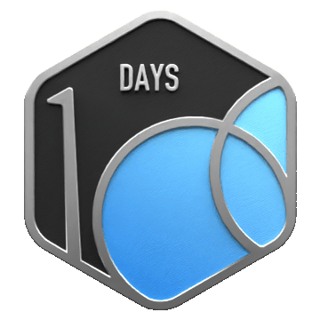

<!-- Dynamic Animated Banner -->
<div align="center">
  
</div>

<br>
<br>

<!-- 🟢 Hacker Terminal Intro -->
<div align="center">


</div>


## 🧠 About Me


<div align="left">

```yaml
name: Mayur Hiware
located_in: Kolhapur, India
current_job: LeetCoder 😅
education:
  - "B.Tech in Computer Science"

fields_of_interest:
  - "Machine Learning"
  - "Deep Learning"
  - "Full Stack Development"
  - "Computer Vision"
  - "Natural Language Processing"

hobbies: ["Coding", "Playing", "Reading", "Open Source"]
```

</div>


---

## 💻 Tech Universe

<p align="center">

</p>

---

# 🟧 LeetCode Badges (Earned)

<p align="center">
  
  
  
</p>

<!-- 

## 🚀 GitHub Insights & Top Languages

<p align="center">
  
  
</p>

<p align="center">
  
</p>

--->

<!-- ## 📈 Contribution Graph

<p align="center">

</p>


### 🏅 LeetCode Stats 

<p align="center">
  
</p>
--->

# 🐍 Contribution Snake

<p align="center">
  
</p>

---


## 🏆 GitHub Trophies

<p align="center">
    
</p>    

---

<!-- Social Connect with Advanced Badges -->
<h2 align="center">🌐 Connect & Collaborate</h2>

<p align="center">
  <a href="https://www.linkedin.com/in/mayur-hiware/">
    
  </a>
  <a href="https://www.instagram.com/mayur.hiware.79/">
    
  </a>
  <a href="mailto:mayurhiware01@gmail.com">
    
  </a>
  <a href="https://www.reddit.com/user/Economy_Smell_5481/">
    
  </a>
 
</p>

---

## 💬 Random Developer Quote

<p align="center">

</p>


<br>

<p align="center">
  
</p>
